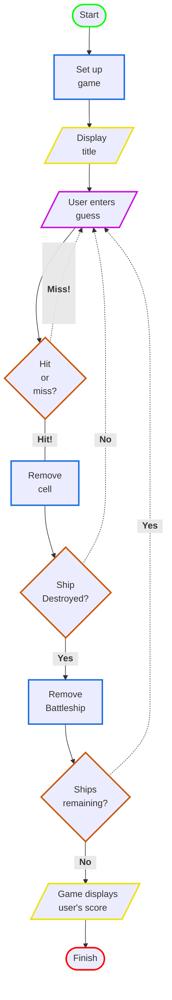
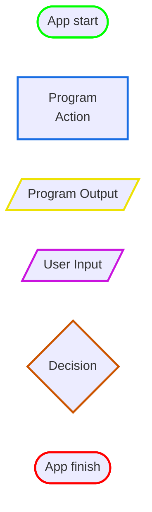

# Battleship - The Classic Strategy Guessing Game

### **How to play:**

The computer will prompt the player for a guess (a cell location) that will be entered into
the console.  
For example, "A3", "F2", and so forth.  
The program will check the user's guess and determine if a hit or miss occurs.  
If a ship receives three consecutive hits, it is destroyed and removed from the game.

### **Goal:**

Sink all the computer's battleships in the fewest number of guesses.  
At the end, the player receives a rating based on performance.

### **Setup:**

When the program is launched, the program randomly places three battleships on a virtual
7x7 grid.  
An example layout is shown below:

When the setup is complete, the game asks the player for the first guess.

 

## Design Diagram

## Diagram Legend

 

## Future Ideas for Improvement

### Addition of a GUI

While the game functions as expected, it can be a little difficult for a user to keep track of all their guesses.  
It would be great to include a graphic interface allowing players to pick their guessing locations and have previous
guesses tracked visually.

### Prevent repeat guesses

Currently, a player can accidentally enter the same location multiple times when guessing.  
Adding the capability to avoid counting previous guesses would improve the player experience.

### Better game function separation

There's a lot of condensed logic in the Main class and in other locations as well.  
It would be a big improvement to place some of these functions in their own classes and organize things further. 