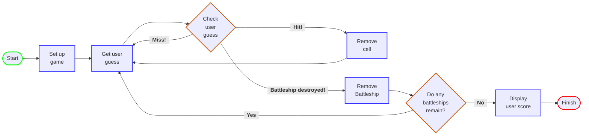

# Battleship Game

### **Goal:**
Sink all the computer's battleships in the fewest number of guesses.  
At the end, the player receives a rating based on performance.  
 

### **Setup:**
When the program is launched, the computer places three battleships on a virtual
7x7 grid. Each battleship takes up three cells.  
When that's complete, the game asks the player for the first guess.  
 

### **How to play:**
The computer will prompt the player for a guess (a cell) that will be entered into
the terminal as "A3", "A5", etc.  
In response to the guess, the player will see a result in the terminal
indicating "Hit", "Miss", or "Battleship destroyed!".

When the player destroys every battleship, the game ends by displaying the user's rating.
 
 

## Visualization

An example game would have the following layout on the virtual grid:

</img>

 
 

## Design Diagram

